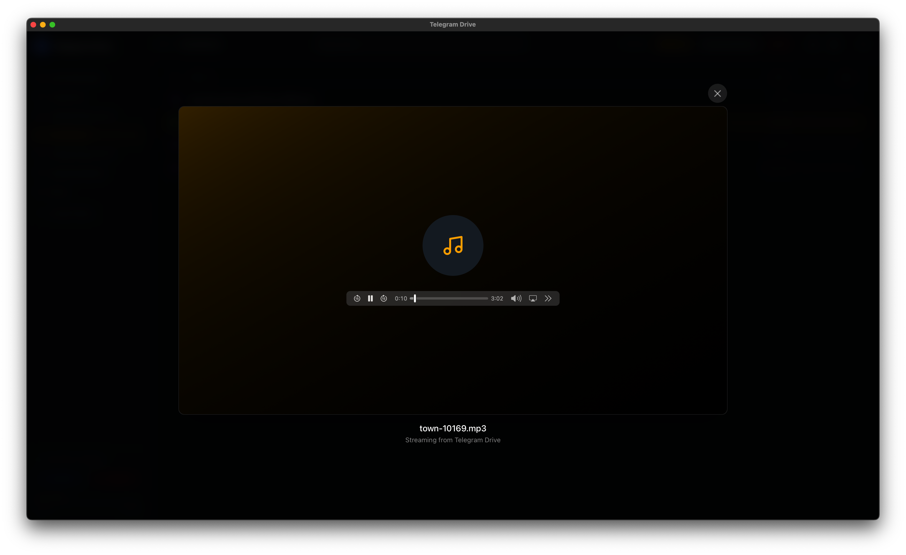

<div align="center">
  

  <h1>Telegram Drive</h1>

  

  <p>
    A fast, privacy-focused cloud drive built on Telegram, React, TypeScript, Rust, and Tauri.
  </p>

  <p>
    <a href="https://sachinmandawi.github.io/Telegram-Drive/">
      
    </a>
    <a href="https://github.com/sachinmandawi/Telegram-Drive/releases/latest">
      
    </a>
    <a href="LICENSE">
      
    </a>
  </p>

  <p>
    <a href="https://github.com/sachinmandawi/Telegram-Drive/actions/workflows/pages.yml">
      
    </a>
    <a href="https://github.com/sachinmandawi/Telegram-Drive/actions/workflows/release.yml">
      
    </a>
  </p>
</div>

## Live App

Use Telegram Drive directly in your browser:

**https://sachinmandawi.github.io/Telegram-Drive/**

Desktop installers and Android APK builds are published from GitHub Releases:

**https://github.com/sachinmandawi/Telegram-Drive/releases/latest**

## What It Does

Telegram Drive turns your Telegram Saved Messages into a familiar drive-style file manager. Upload files, create virtual folders, preview documents/media, move items around, restore from Trash, and keep the drive index synced through a Telegram-backed manifest.

## Latest Highlights

- Full-screen Google Drive-style previews with keyboard, swipe, and horizontal-scroll navigation.
- Image preview supports zoom, pan, rotate, and reset controls.
- PDF preview includes page thumbnails plus zoom, rotate, and reset controls.
- Upload queue supports pause/resume and automatic retry scheduling for failed transfers.
- Duplicate uploads can be saved as versions, kept as renamed copies, replaced, or skipped.
- MaterialFiles-style cut, copy, paste, rename, delete, properties, and full-screen preview controls are available from the item menu and viewer.
- The context menu includes direct move actions and labeled folder color choices.
- The grid uses a compact file-manager layout with thumbnails and per-item overflow menus.
- ZIP, XLSX, PPTX, DOCX, CSV/TSV, text, images, and unsupported files have richer previews or metadata views.
- Mobile and compact grids stay usable on touch screens, while desktop grids scale by available width.
- Folder moves update immediately and preserve nested children instead of flattening folder trees.
- OCR and the heavy Tesseract dependency were removed.
- Manual checksum verification was removed from the UI.
- Website, desktop, and Android APK release workflows are aligned under `v1.1.45`.

## Features

| Drive | Preview | Safety |
| --- | --- | --- |
| Saved Messages storage | Full-screen image preview | Recoverable Trash |
| Virtual folder tree | Audio/video streaming | Repair Index |
| Drag and drop upload | PDF viewer with zoom/rotate | Manifest backup/import |
| Folder upload | Text/CSV/TSV/DOCX preview | Recovery tools |
| Bulk move/download/delete | Preview search | Offline cache |
| Tags and smart search | Thumbnails | Multi-account sessions |

## Screenshots

| Dashboard | Full Preview |
| --- | --- |
|  |  |

| Grid | Upload |
| --- | --- |
|  |  |

| Audio | Video |
| --- | --- |
|  |  |

## Download Options

| Platform | How to use |
| --- | --- |
| Website | Open the live website link above and sign in with Telegram API credentials. |
| Windows | Download the `.msi` or `.exe` asset from the latest release. |
| macOS/Linux | Download the Intel, Apple Silicon, AppImage, or package asset generated for your platform. |
| Android | Download the debug APK that matches your device ABI, or use the universal/debug asset if present. |

> Android APKs are debug-signed for testing. Use a release keystore before publishing to an app store.

## Tech Stack

- **Frontend:** React, TypeScript, Tailwind CSS, Framer Motion
- **Desktop:** Tauri v2, Rust
- **Telegram:** GramJS in browser/Saved Messages mode, Grammers in desktop legacy mode
- **Build:** Vite, GitHub Actions, GitHub Pages

## Local Development

### Prerequisites

- Node.js 18+
- Rust latest stable
- Tauri v2 system prerequisites
- Telegram API ID and API Hash from https://my.telegram.org

Windows also needs Visual Studio Build Tools with the **Desktop development with C++** workload. Windows 10/11 normally includes WebView2, but you can install it from Microsoft if Tauri asks for it.

### Run Locally

```bash
git clone https://github.com/sachinmandawi/Telegram-Drive.git
cd Telegram-Drive/app
npm install
npm run dev
```

### Run Desktop App

```bash
cd app
npm run tauri dev
```

### Build

```bash
cd app
npm run build
npm run tauri build
```

## Telegram Credentials

1. Go to https://my.telegram.org.
2. Open **API development tools**.
3. Create an app and copy `api_id` and `api_hash`.
4. Paste them into Telegram Drive during login.

For hosted website builds, credentials are entered locally in the browser. They are not committed to this repository.

## Notes

- The first desktop build may take 5 to 15 minutes because Rust dependencies compile locally.
- Release installers are published through GitHub Actions.
- Tauri updater metadata (`latest.json`) requires `TAURI_SIGNING_PRIVATE_KEY` and `TAURI_SIGNING_PRIVATE_KEY_PASSWORD` secrets.

## License

Owned and maintained by **Sachin Mandavi** ([@sachinmandawi](https://github.com/sachinmandawi)).

Copyright (c) 2026 **Sachin Mandavi**.

Licensed under the **MIT License**. See [LICENSE](LICENSE) and [NOTICE.md](NOTICE.md).

> Telegram Drive is not affiliated with Telegram FZ-LLC. Use it responsibly and follow Telegram's Terms of Service.
